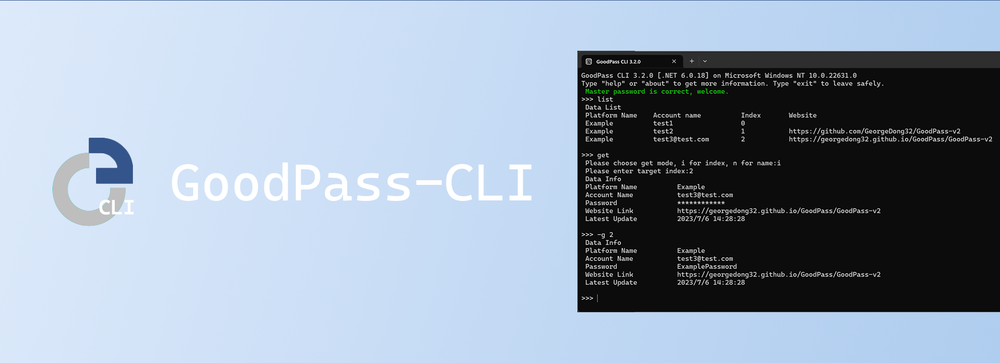

- ## GoodPass Project
  一个开源的密码管家项目，包含以下子项目：
  - ### GoodPass GUI
      

      [前往项目](https://github.com/GeorgeDong32/GoodPass-GUI)
  - ### GoodPass CLI
      
      
    [前往项目](https://github.com/GeorgeDong32/GoodPass-GUI)
- ## SYSU Learn
  记录在SYSU的一些学习经历和课程项目，由以下项目构成：
  - [SYSU_Matrix_2022](https://github.com/GeorgeDong32/SYSU_Matrix_2022)：2022年Matrix C++课程题目及解答
  - [IntelliCar](https://github.com/GeorgeDong32/IntelliCar)：电子线路开放性实验智能小车项目
  - [FIADS](https://github.com/GeorgeDong32/FIADS)：HDL与FPGA课程期末设计-FPGA图像采集与显示系统
